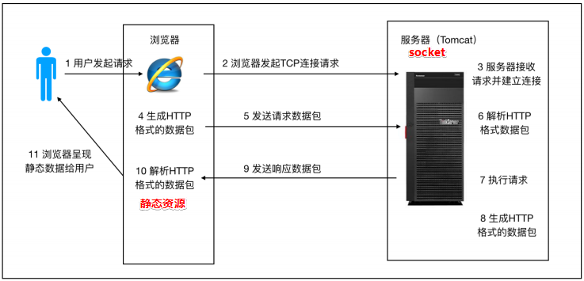

> 当前位置：【Java】12_ 团队效率  -> 12.8_部署容器 - > 01_ApacheTomcat


# 1、Tomcat 下载安装和配置

## 1.0 Tomcat 下载

- 官网地址：https://tomcat.apache.org/


## 1.1 Win系统 -  Tomcat安装和配置


## 1.2 Linux系统 -  Tomcat安装和配置


## 1.3 Mac系统 -  Tomcat安装和配置


## 1.4 Tomcat 目录结构


### （1）bin

```
- 该目录下存放的是二进制可执行文件
- 如果是安装版，这个目录下会有 tomcat6.exe（在控制台下启动Tomcat）、tomcat6w.exe（弹出UGI窗口启动Tomcat）
- 如果是解压版，这个目录下会有 startup.bat（用来启动Tomcat，需要先配置JAVA_HOME环境变量）、shutdown.bat（用来停止Tomcat）
```

### （2）conf

```
这个目录下有四个最为重要的文件:
- server.xml：配置整个服务器信息（例如修改端口号，添加虚拟主机等）

- tomcatusers.xml：存储tomcat用户的文件，这里保存的是tomcat的用户名及密码，以及用户的角色信息。可以按着该文件中的注释信息添加tomcat用户，然后就可以在Tomcat主页中进入Tomcat Manager页面了

- web.xml：部署描述符文件，这个文件中注册了很多MIME类型，即文档类型。这些MIME类型是客户端与服务器之间说明文档类型的，如用户请求一个html网页，那么服务器还会告诉客户端浏览器响应的文档是text/html类型的，这就是一个MIME类型。客户端浏览器通过这个MIME类型就知道如何处理它了。当然是在浏览器中显示这个html文件了。但如果服务器响应的是一个exe文件，那么浏览器就不可能显示它，而是应该弹出下载窗口才对。MIME就是用来说明文档的内容是什么类型的！

- context.xml：对所有应用的统一配置，通常不会去配置它
```

### （3）lib

```
- Tomcat的类库，里面是一大堆jar文件
- 如果需要添加Tomcat依赖的jar文件，可以把它放到这个目录中
- 也可以把应用依赖的jar文件放到这个目录中，这个目录中的jar所有项目都可以共享之，但如果应用再放到其他Tomcat下时就不能再共享这个目录下的Jar包了，所以建议只把Tomcat需要的Jar包放到这个目录下
```

### （4）logs

```
- 记录了Tomcat启动和关闭的信息
- 如果启动Tomcat时有错误，那么异常也会记录在日志文件中
```

### （5）temp

```
- 存放Tomcat的临时文件
- 这个目录下的东西可以在停止Tomcat后删除！
```

### （6）webapps

```
- 存放web项目的目录，其中每个文件夹都是一个项目
- 如果这个目录下已经存在了目录，那么都是tomcat自带的项目
- 其中ROOT是一个特殊的项目，在地址栏中没有给出项目目录时，对应的就是ROOT项目
- http://localhost:8080/examples，进入示例项目，其中examples就是项目名，即文件夹的名字
```

### （7）work

```
- 运行时生成的文件，最终运行的文件都在这里
- 通过webapps中的项目生成的！可以把这个目录下的内容删除，再次运行时会生再次生成work目录
- 当客户端用户访问一个JSP文件时，Tomcat会通过JSP生成Java文件，然后再编译Java文件生成class文件，生成的java和class文件都会存放到这个目录下
```


## 1.5 核心配置文件 conf/server.xml 详解

### （1）Server 根标签

```xml
<!-- Server 根元素，创建⼀个Server实例 -->
<Server>
	<!-- 定义监听器 -->
	<Listener/>
	
	<!-- 定义服务器的全局JNDI资源 -->
	<GlobalNamingResources/>
	
	<!-- 定义⼀个Service服务，⼀个Server标签可以有多个Service服务实例 -->
	<Service/>
</Server>
```


```xml
<!--
 port：关闭服务器的监听端⼝
 shutdown：关闭服务器的指令字符串
-->
<Server port="8005" shutdown="SHUTDOWN">
	<!-- 以⽇志形式输出服务器 、操作系统、JVM的版本信息 -->
	<Listener className="org.apache.catalina.startup.VersionLoggerListener"/>
	
	<!-- Security listener. Documentation at /docs/config/listeners.html
	<Listener className="org.apache.catalina.security.SecurityListener" />-->

	<!--APR library loader. Documentation at /docs/apr.html -->
	<!-- 加载（服务器启动）和 销毁 （服务器停⽌）APR。 如果找不到APR库，则会输出⽇志，并不影响 Tomcat 启动 -->
	<Listener SSLEngine="on" className="org.apache.catalina.core.AprLifecycleListener"/>

	<!-- Prevent memory leaks due to use of particular java/javax APIs-->
	<!-- 避免JRE内存泄漏问题 -->
	<Listener className="org.apache.catalina.core.JreMemoryLeakPreventionListener"/>
	
	<!-- 加载（服务器启动） 和 销毁（服务器停⽌） 全局命名服务 -->
	<Listener className="org.apache.catalina.mbPeans.GlobalResourcesLifecycleListener"/>
	
	<!-- 在Context停⽌时重建 Executor 池中的线程， 以避免ThreadLocal 相关的内存泄漏 -->
	<Listener className="org.apache.catalina.core.ThreadLocalLeakPreventionListener"/>
	
	<!-- Global JNDI resources  Documentation at /docs/jndi-resources-howto.html
	GlobalNamingResources 中定义了全局命名服务
	-->
	<GlobalNamingResources>
		<!-- Editable user database that can also be used by UserDatabaseRealm to authenticate users-->
		<Resource auth="Container" description="User database that can be updated and saved" factory="org.apache.catalina.users.MemoryUserDatabaseFactory" name="UserDatabase" pathname="conf/tomcat-users.xml" type="org.apache.catalina.UserDatabase"/>
	</GlobalNamingResources>
	
  <!-- A "Service" is a collection of one or more "Connectors" that share a single "Container" Note: A "Service" is not itself a "Container", so you may not define subcomponents such as "Valves" at this level.Documentation at /docs/config/service.html-->
	<Service name="Catalina">
		...
 	</Service>
</Server>
```

### （2）Service标签

```xml
<!-- 该标签⽤于创建 Service 实例，默认使⽤ org.apache.catalina.core.StandardService -->
<!-- 默认情况下，Tomcat 仅指定了Service 的名称， 值为 "Catalina" -->
<Service name="Catalina">
	<!-- ⽤于为Service添加⽣命周期监听器 -->
	<Listener/>

	<!-- ⽤于配置Service 共享线程池 -->
	<Executor/>

	<!-- ⽤于配置Service 包含的链接器 -->
	<Connector/>

	<!-- ⽤于配置Service中链接器对应的Servlet 容器引擎 -->
	<Engine/>
</Service>
```

（3）Executor

```xml
```


（4）Connector

（5）Engine


# 2、Tomcat 架构设计

## 2.0 浏览器访问服务器的流程


## 2.1 Tomcat 是一个 http 服务器

```
- Tomcat 能够接收并且处理 http 请求，所以它是一个 http 服务器

- 浏览器访问服务器使用的是Http协议，Http是应用层协议，用于定义数据通信的格式，具体的数据传输使用的是TCP/IP协议，Http服务器接收到这个请求之后，会调用具体的程序（Java类）进行处理，往往不同的请求由不同的Java类完成处理
```

- 浏览器访问服务器的流程



## 2.2 Tomcat 是一个 Servlet 容器

```
- HTTP 服务器接收到请求之后把请求交给Servlet容器来处理，Servlet 容器通过Servlet接口调用业务类。Servlet接口和Servlet容器这一整套内容叫作Servlet规范
```

- Tomcat Servlet容器处理流程


```
当用户请求某个URL资源时
（1）HTTP服务器会把请求信息使用 ServletRequest 对象封装起来
（2）进一步去调用 Servlet 容器中某个具体的 Servlet
（3）Servlet 容器拿到请求后，根据 URL 和 Servlet 的映射关系，找到相应的 Servlet
（4）如果 Servlet 还没有被加载，就使用反射机制创建这个 Servlet，并调用 Servlet 的 init 方法来完成初始化
（5）接着调用这个具体 Servlet 的 service 方法来处理请求，请求处理结果使用 ServletResponse 对象封装
（6）把 ServletResponse 对象返回给 HTTP 服务器，HTTP 服务器会把响应发送给客户端
```


## 2.3 Tomcat 总体架构

```
两大核心组件：连接器（Connector）和容器（Container）

连接器（Connector）：负责对外交流，处理Socket连接，负责网络字节流与 Request 和 Response 对象的转化
容器（Container）：负责内部处理，加载和管理 Servlet，以及具体处理 Request 请求
```

Tomcat是⼀个由⼀系列可配置（conf/server.xml）的组件构成的Web容器，⽽Catalina是Tomcat的servlet容器，是 Tomcat 的核心 ， 其他模块都是为Catalina 提供⽀撑的。 ⽐如 ： 通过 Coyote 模块提供链接通信，Jasper 模块提供 JSP 引擎，Naming 提供JNDI 服务，Juli 提供⽇志服务。


## 2.4 Tomcat 连接器组件 - Coyote

### （1）**Coyote** 简介

```
Coyote 是Tomcat 中连接器的组件名称 , 是对外的接口，客户端通过Coyote与服务器建⽴连接、发送请求并接受响应

（1）Coyote 封装了底层的⽹络通信（Socket 请求及响应处理）
（2）Coyote 使Catalina 容器（容器组件）与具体的请求协议及IO操作⽅式完全解耦
（3）Coyote 将Socket 输⼊转换封装为 Request 对象，进⼀步封装后交由Catalina 容器进⾏处理，处理请求完成后, Catalina 通过Coyote 提供的Response 对象将结果写⼊输出流
（4）Coyote 负责的是具体协议（应⽤层）和IO（传输层）相关内容
```


### （2）Coyote 支持的 IO 模型

- 传输层 IO模型

| IO模型 | 描述                                                         |
| ------ | ------------------------------------------------------------ |
| BIO    | 同步阻塞I/O（Tomcat 8.0之前默认采用）                        |
| NIO    | 同步非阻塞I/O，采用Java NIO类库实现（默认的IO模型）          |
| NIO2   | 异步I/O，采用 JDK7 最新 NIO2 类库实现                        |
| APR    | 采用Apache 可移植运行库实现，是C/C++编写的本地库（需要单独安装APR库） |


### （3）Coyote 支持的协议

- 应用层协议

| 应用层协议 | 描述                                                         |
| ---------- | ------------------------------------------------------------ |
| HTTP/1.1   | 大部分Web应用采用的访问协议（Tomcat默认）                    |
| AJP        | 用于和WX集成以实现对静态资源的优化以及集群部署（当前支持AJP/1.3） |
| HTTP/2.0   | 大幅度提升了Web性能（Tomcat 8.5 和Tomcat 9.0版本之后支持）   |


### （4）Coyote的内部组件及流程


| **组件**        | 作用描述                                                     |
| --------------- | ------------------------------------------------------------ |
| EndPoint        | EndPoint 是 Coyote 通信端点，即通信监听的接⼝，是具体Socket接收和发送处理器，是对传输层的抽象，因此EndPoint⽤来实现TCP/IP协议的 |
| Processor       | Processor 是Coyote 协议处理接⼝ ，如果说EndPoint是⽤来实现TCP/IP协议的，那么Processor⽤来实现HTTP协议，Processor接收来⾃EndPoint的Socket，读取字节流解析成Tomcat Request和Response对象，并通过Adapter将其提交到容器处理，Processor是对应⽤层协议的抽象 |
| ProtocolHandler | Coyote 协议接⼝， 通过Endpoint 和 Processor ， 实现针对具体协议的处理能⼒。Tomcat 按照协议和I/O 提供了6个实现类 ： AjpNioProtocol ，AjpAprProtocol， AjpNio2Protocol ， Http11NioProtocol ，Http11Nio2Protocol ，Http11AprProtocol |
| Adapter         | 由于协议不同，客户端发过来的请求信息也不尽相同，Tomcat定义了⾃⼰的Request类来封装这些请求信息。ProtocolHandler接⼝负责解析请求并⽣成Tomcat Request类。但是这个Request对象不是标准的ServletRequest，不能⽤Tomcat Request作为参数来调⽤容器。Tomcat设计者的解决⽅案是引⼊CoyoteAdapter，这是适配器模式的经典运⽤，连接器调⽤CoyoteAdapter的Sevice⽅法，传⼊的是Tomcat Request对象，CoyoteAdapter负责将Tomcat Request转成ServletRequest，再调⽤容器 |


## 2.5 Tomcat Servlet 容器组件 -  **Catalina**

### （1）Tomcat/Catalina实例

- 整个Tomcat就是⼀个Catalina实例，Tomcat 启动的时候会初始化这个实例，Catalina实例通过加载server.xml完成其他实例的创建，创建并管理⼀个Server，Server创建并管理多个服务，每个服务又可以有多个Connector和⼀个Container

```
⼀个Catalina实例（容器）
		⼀个 Server实例（容器）
				多个Service实例（容器）
        		每⼀个Service实例下可以有多个Connector实例和⼀个Container实例
```


```
Catalina
- 负责解析 Tomcat 的配置⽂件（server.xml） , 以此来创建服务器 Server 组件并进行管理

Server
- 服务器表示整个 Catalina servlet 容器以及其它组件，负责组装并启动 servlet 引擎,Tomcat 连接器。Server 通过实现 Lifecycle 接口，提供了⼀种优雅的启动和关闭整个系统的⽅式

Service（多个）
- 服务是 Server 内部的组件，⼀个 Server 包含多个 Service。它将若干个 Connector 组件绑定到⼀个 Container

Container（一个）
- 容器，负责处理用户的 servlet 请求，并返回对象给 web 用户的模块
```


### （2）Container 组件结构

```
Engine（一个）
- 表示整个 Catalina 的 Servlet 引擎，⽤来管理多个虚拟站点，⼀个Service最多只能有⼀个Engine，但是⼀个引擎可包含多个Host

Host（多个）
- 代表⼀个虚拟主机，或者说⼀个站点，可以给Tomcat配置多个虚拟主机地址，⽽⼀个虚拟主机下可包含多个Context

Context（多个）
- 表示⼀个Web应⽤程序， ⼀个Web应⽤可包含多个Wrapper

Wrapper（多个）
- 表示⼀个Servlet，Wrapper 作为容器中的最底层，不能包含⼦容器

上述组件的配置其实就体现在conf/server.xml中。
```


# 3、Tomcat 迷你版实现


# 4、Tomcat 源码分析


# 5、Tomcat 类加载机制


# 6、Tomcat 性能优化

##### 优化思路 1：核心组件

##### 优化思路 2：非核心组件 

##### 优化思路 3：web.xml 

##### 优化思路 4：JVM层面


##### 优化思路 5：启动速度优化

```xml
- 删除没用的web应用

- 关闭websocket

- 随机数优化

- 多线程启动web应用
<Host startStopThreads="0"> 
</Host>
```


##### 优化思路 6：其他方面

- Connector 配置压缩属性compression=“500”，文件大于500bytes才会压缩
- 数据库优化 减少对数据库访问等待的时间，缓存方案考虑一下
- 开启浏览器缓存、nginx静态资源部署等 开启浏览器缓存，cdn静态资源服务器，nginx
- too many open files 关掉无用的句柄或者增加句柄数:ulimit -n 10000


https://blog.csdn.net/qq_41517071/article/details/82181003