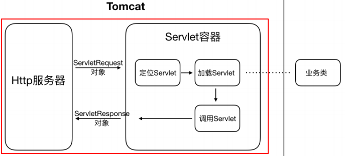

> 当前位置：【Java】12_ 团队效率  -> 12.8_部署容器 - > 01_ApacheTomcat


# 1、Tomcat 下载安装和配置

## 1.0 Tomcat 下载

- 官网地址：https://tomcat.apache.org/


## 1.1 Win系统 -  Tomcat安装和配置


## 1.2 Linux系统 -  Tomcat安装和配置


## 1.3 Mac系统 -  Tomcat安装和配置


## 1.4 Tomcat 目录结构


### （1）bin

```
- 该目录下存放的是二进制可执行文件
- 如果是安装版，这个目录下会有 tomcat6.exe（在控制台下启动Tomcat）、tomcat6w.exe（弹出UGI窗口启动Tomcat）
- 如果是解压版，这个目录下会有 startup.bat（用来启动Tomcat，需要先配置JAVA_HOME环境变量）、shutdown.bat（用来停止Tomcat）
```

### （2）conf

```
这个目录下有四个最为重要的文件:
- server.xml：配置整个服务器信息（例如修改端口号，添加虚拟主机等）

- tomcatusers.xml：存储tomcat用户的文件，这里保存的是tomcat的用户名及密码，以及用户的角色信息。可以按着该文件中的注释信息添加tomcat用户，然后就可以在Tomcat主页中进入Tomcat Manager页面了

- web.xml：部署描述符文件，这个文件中注册了很多MIME类型，即文档类型。这些MIME类型是客户端与服务器之间说明文档类型的，如用户请求一个html网页，那么服务器还会告诉客户端浏览器响应的文档是text/html类型的，这就是一个MIME类型。客户端浏览器通过这个MIME类型就知道如何处理它了。当然是在浏览器中显示这个html文件了。但如果服务器响应的是一个exe文件，那么浏览器就不可能显示它，而是应该弹出下载窗口才对。MIME就是用来说明文档的内容是什么类型的！

- context.xml：对所有应用的统一配置，通常不会去配置它
```

### （3）lib

```
- Tomcat的类库，里面是一大堆jar文件
- 如果需要添加Tomcat依赖的jar文件，可以把它放到这个目录中
- 也可以把应用依赖的jar文件放到这个目录中，这个目录中的jar所有项目都可以共享之，但如果应用再放到其他Tomcat下时就不能再共享这个目录下的Jar包了，所以建议只把Tomcat需要的Jar包放到这个目录下
```

### （4）logs

```
- 记录了Tomcat启动和关闭的信息
- 如果启动Tomcat时有错误，那么异常也会记录在日志文件中
```

### （5）temp

```
- 存放Tomcat的临时文件
- 这个目录下的东西可以在停止Tomcat后删除！
```

### （6）webapps

```
- 存放web项目的目录，其中每个文件夹都是一个项目
- 如果这个目录下已经存在了目录，那么都是tomcat自带的项目
- 其中ROOT是一个特殊的项目，在地址栏中没有给出项目目录时，对应的就是ROOT项目
- http://localhost:8080/examples，进入示例项目，其中examples就是项目名，即文件夹的名字
```

### （7）work

```
- 运行时生成的文件，最终运行的文件都在这里
- 通过webapps中的项目生成的！可以把这个目录下的内容删除，再次运行时会生再次生成work目录
- 当客户端用户访问一个JSP文件时，Tomcat会通过JSP生成Java文件，然后再编译Java文件生成class文件，生成的java和class文件都会存放到这个目录下
```


## 1.5 核心配置文件 server.xml 详解


# 2、Tomcat 架构设计

## 2.0 浏览器访问服务器的流程


## 2.1 Tomcat 是一个 http 服务器

```
- Tomcat 能够接收并且处理 http 请求，所以它是一个 http 服务器

- 浏览器访问服务器使用的是Http协议，Http是应用层协议，用于定义数据通信的格式，具体的数据传输使用的是TCP/IP协议，Http服务器接收到这个请求之后，会调用具体的程序（Java类）进行处理，往往不同的请求由不同的Java类完成处理
```

- 浏览器访问服务器的流程


## 2.2 Tomcat 是一个 Servlet 容器

```
- HTTP 服务器接收到请求之后把请求交给Servlet容器来处理，Servlet 容器通过Servlet接口调用业务类。Servlet接口和Servlet容器这一整套内容叫作Servlet规范
```

- Tomcat Servlet容器处理流程



```
当用户请求某个URL资源时
（1）HTTP服务器会把请求信息使用 ServletRequest 对象封装起来
（2）进一步去调用 Servlet 容器中某个具体的 Servlet
（3）Servlet 容器拿到请求后，根据 URL 和 Servlet 的映射关系，找到相应的 Servlet
（4）如果 Servlet 还没有被加载，就使用反射机制创建这个 Servlet，并调用 Servlet 的 init 方法来完成初始化
（5）接着调用这个具体 Servlet 的 service 方法来处理请求，请求处理结果使用 ServletResponse 对象封装
（6）把 ServletResponse 对象返回给 HTTP 服务器，HTTP 服务器会把响应发送给客户端
```


## 2.3 Tomcat 总体架构

```
两大核心组件：连接器（Connector）和容器（Container）

连接器（Connector）：负责对外交流，处理Socket连接，负责网络字节流与 Request 和 Response 对象的转化
容器（Container）：负责内部处理，加载和管理 Servlet，以及具体处理 Request 请求
```


## 2.4 Tomcat 连接器组件 - Coyote

### （1）**Coyote** 简介

### （2）Coyote 支持的 IO 模型

BIO，同步阻塞I/O

NIO，同步非阻塞I/O

NIO2，异步I/O

### （3）Coyote 支持的协议


### （4）Coyote的内部组件及流程


## 2.5 Tomcat Servlet 容器组件 -  **Catalina**


# 3、Tomcat 迷你版实现


# 4、Tomcat 源码分析


# 5、Tomcat 类加载机制


# 6、Tomcat 性能优化

##### 优化思路 1：核心组件

##### 优化思路 2：非核心组件 

##### 优化思路 3：web.xml 

##### 优化思路 4：JVM层面


##### 优化思路 5：启动速度优化

```xml
- 删除没用的web应用

- 关闭websocket

- 随机数优化

- 多线程启动web应用
<Host startStopThreads="0"> 
</Host>
```


##### 优化思路 6：其他方面

- Connector 配置压缩属性compression=“500”，文件大于500bytes才会压缩
- 数据库优化 减少对数据库访问等待的时间，缓存方案考虑一下
- 开启浏览器缓存、nginx静态资源部署等 开启浏览器缓存，cdn静态资源服务器，nginx
- too many open files 关掉无用的句柄或者增加句柄数:ulimit -n 10000


https://blog.csdn.net/qq_41517071/article/details/82181003